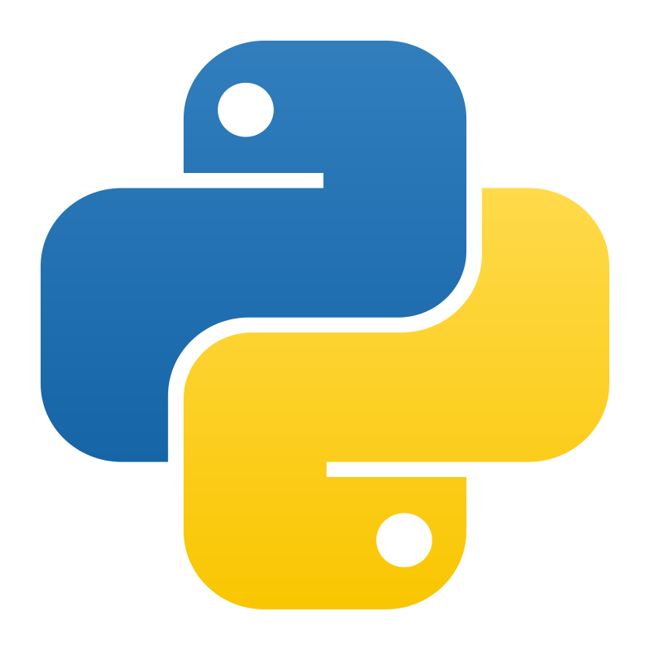
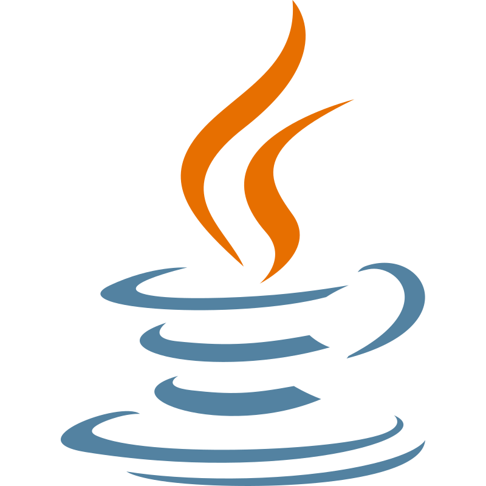
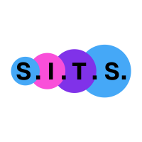

# Hello. I'm 10Rats 🐀.
I'm still a school student who scripts for fun. My programming skills leans towards more on game-developing, but I'm currently learning cybersecurity.

### I live at... 📍
[REDACTED], [REDACTED]

### I speak... 💬
    

### I work at...

<!--
**10Rats/10Rats** is a ✨ _special_ ✨ repository because its `README.md` (this file) appears on your GitHub profile.

Here are some ideas to get you started:

- 🔭 I’m currently working on ...
- 🌱 I’m currently learning ...
- 👯 I’m looking to collaborate on ...
- 🤔 I’m looking for help with ...
- 💬 Ask me about ...
- 📫 How to reach me: ...
- 😄 Pronouns: ...
- ⚡ Fun fact: ...
-->
